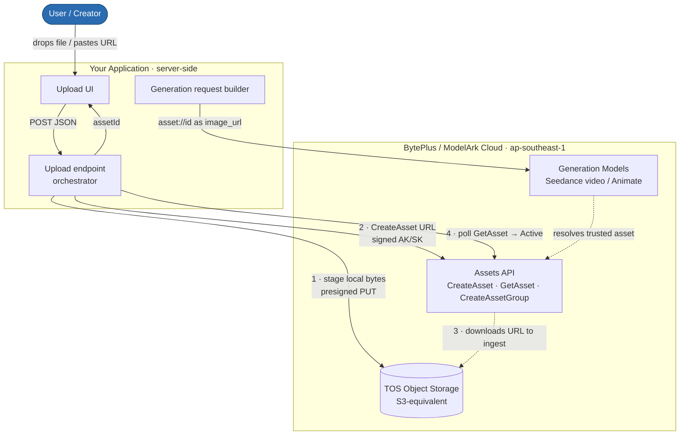
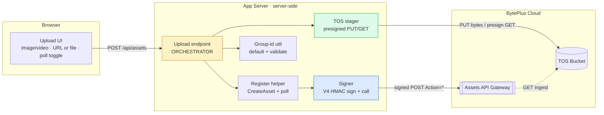
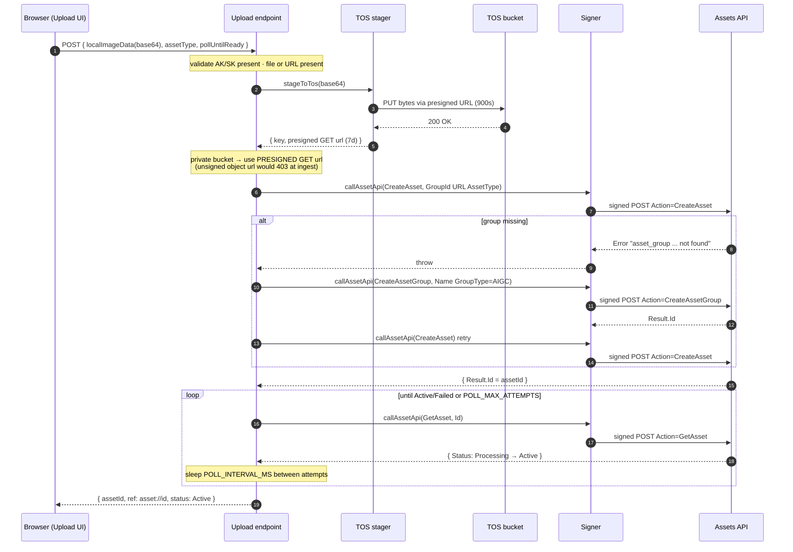
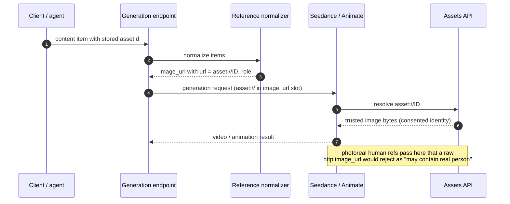
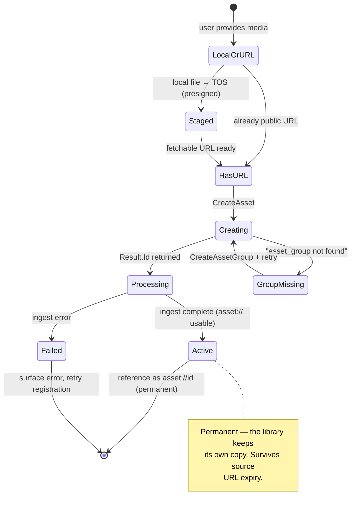
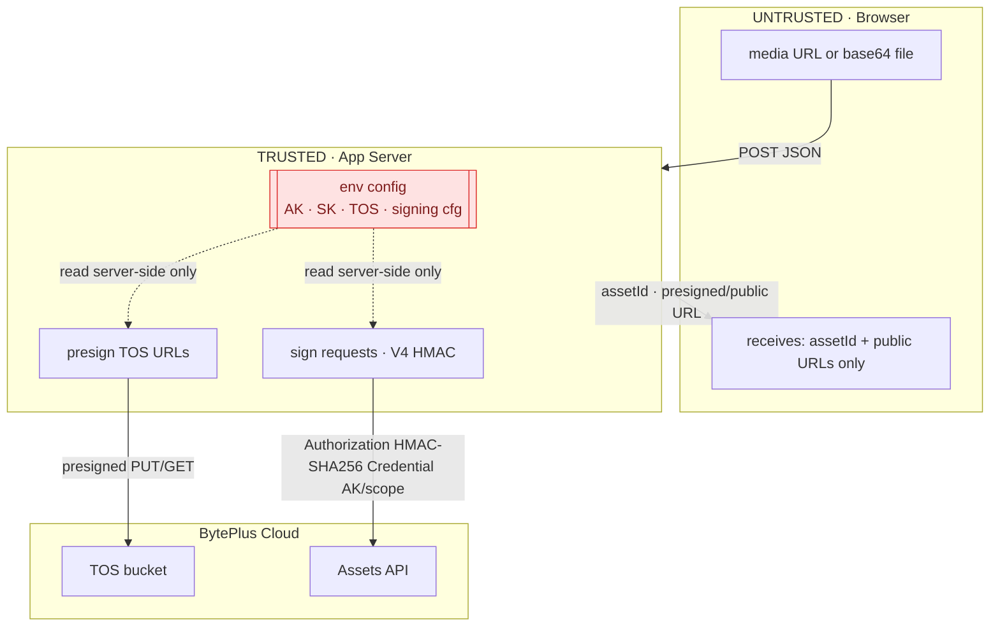
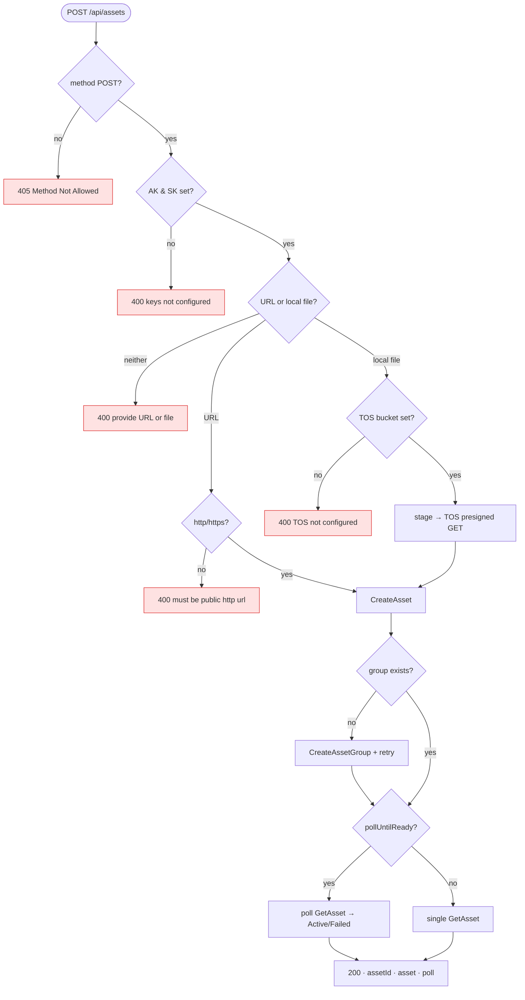
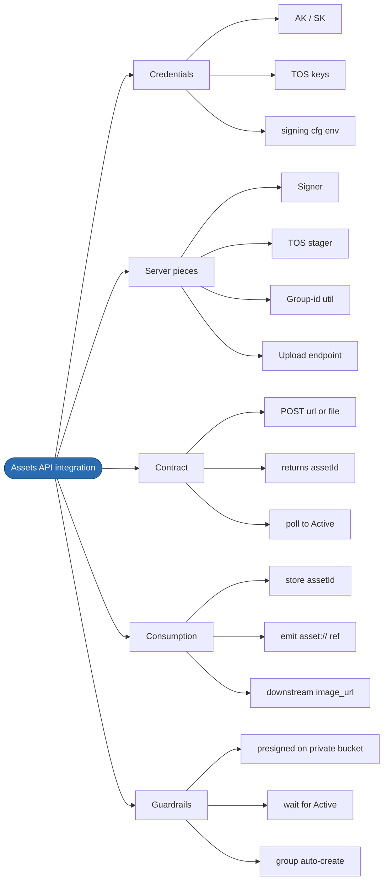

# ModelArk Assets API — Integration Architecture

> Companion to the **Assets API Integration Guide**. This is the **flow-level view** for a
> solutions architect evaluating or planning the integration: system context, components,
> sequences, state, trust boundaries, and failure paths. All diagrams are Mermaid (render on
> GitHub or any Mermaid viewer).
>
> **One-line summary:** a browser hands your app a media URL or local file; your app (server-side,
> holding AK/SK) optionally stages local bytes to **TOS**, calls the **Assets API** to register a
> permanent asset id, polls until `Active`, and returns an `asset://<id>` that downstream
> generation models trust.

---

## 0. Whole flow at a glance

The complete pipeline on one canvas — **register** an asset (blue) once, then **reuse** it
downstream (purple) forever. The rest of this document breaks these same steps into context,
sequence, state, and failure views.

---

## 1. System context (C4 level 1)

**Key boundary:** AK/SK never leave the server. The browser only ever sees `asset://<id>` and
public URLs — never credentials.

---

## 2. Component / container view (C4 level 2)

Names are role-based; map them to whatever modules you create.

| Component | Trust level | Holds secrets? |
|---|---|---|
| Upload UI | untrusted (browser) | no |
| Upload endpoint (orchestrator) | trusted (server) | reads env |
| Register helper | trusted (server) | reads env |
| Signer | trusted (server) | signs with AK/SK |
| TOS stager | trusted (server) | AK/SK for presign |
| Group-id util | pure util | no |

---

## 3. Primary flow — register a **local file** (happy path)

This is the full pipeline. A public-URL registration skips steps 2–4.

---

## 4. Consumption flow — using `asset://` downstream

Registration only pays off when the id is referenced. This is where the "real person" filter and
URL-expiry problems are actually solved.

---

## 5. Asset lifecycle (state machine)

**Readiness gate:** an asset is only resolvable downstream in `Active`. Never emit `asset://<id>`
for a `Processing` asset — poll first.

---

## 6. Trust boundaries & secrets flow

**Rules:**
- AK/SK and TOS keys are **server-only**. Only the (non-secret) asset-group *name* is safe to expose
  to the client if you need it there.
- Signing happens per-request; the signature embeds a dated credential scope
  `{date}/{region}/{service}/{terminal}` so leaked signatures expire.
- Presigned TOS URLs are time-boxed: **PUT 900s**, **GET 7 days** (the presign max) — long enough
  for ingest, short enough to limit exposure on a private bucket.

---

## 7. Decision & failure paths

---

## 8. Deployment & scaling notes

| Concern | Guidance |
|---|---|
| **Where it runs** | The orchestrator is a **server-side** route (any Node backend). It must never run in the browser — it holds AK/SK. |
| **Latency** | Dominated by ingest polling. Budget `POLL_INTERVAL_MS × attempts` (default up to ~120s). For UX, allow `pollUntilReady:false` and let the client poll, or register asynchronously and reference later. |
| **Idempotency** | `CreateAsset` is not idempotent — each call mints a new asset id. De-dupe upstream (e.g. hash the source) if re-registration is a risk. |
| **Group strategy** | One long-lived group is the simplest model; a `group-{ts}-{rand}` scheme also supports per-session/per-project groups. Groups auto-create on first use. |
| **Private vs public bucket** | Private bucket + presigned GET is the secure default. Only configure a public base URL if the bucket is genuinely public-read. |
| **Secrets management** | Keep AK/SK/TOS keys in a secrets manager (Vault / SM / Parameter Store) in production. Rotating AK/SK invalidates nothing already ingested (assets are permanent). |
| **Failure isolation** | Treat registration as an **enhancement, not a hard dependency** unless the real-person bypass is mandatory: wrap it in try/catch so a flaky Assets call never blocks the primary upload. |
| **Region** | Everything is `ap-southeast-1`. Cross-region adds egress + latency; keep bucket, Assets API, and models co-located. |

---

## 9. Minimal integration surface

See the **Assets API Integration Guide** for the credential list, the verbatim signer code, and
the endpoint contract.
