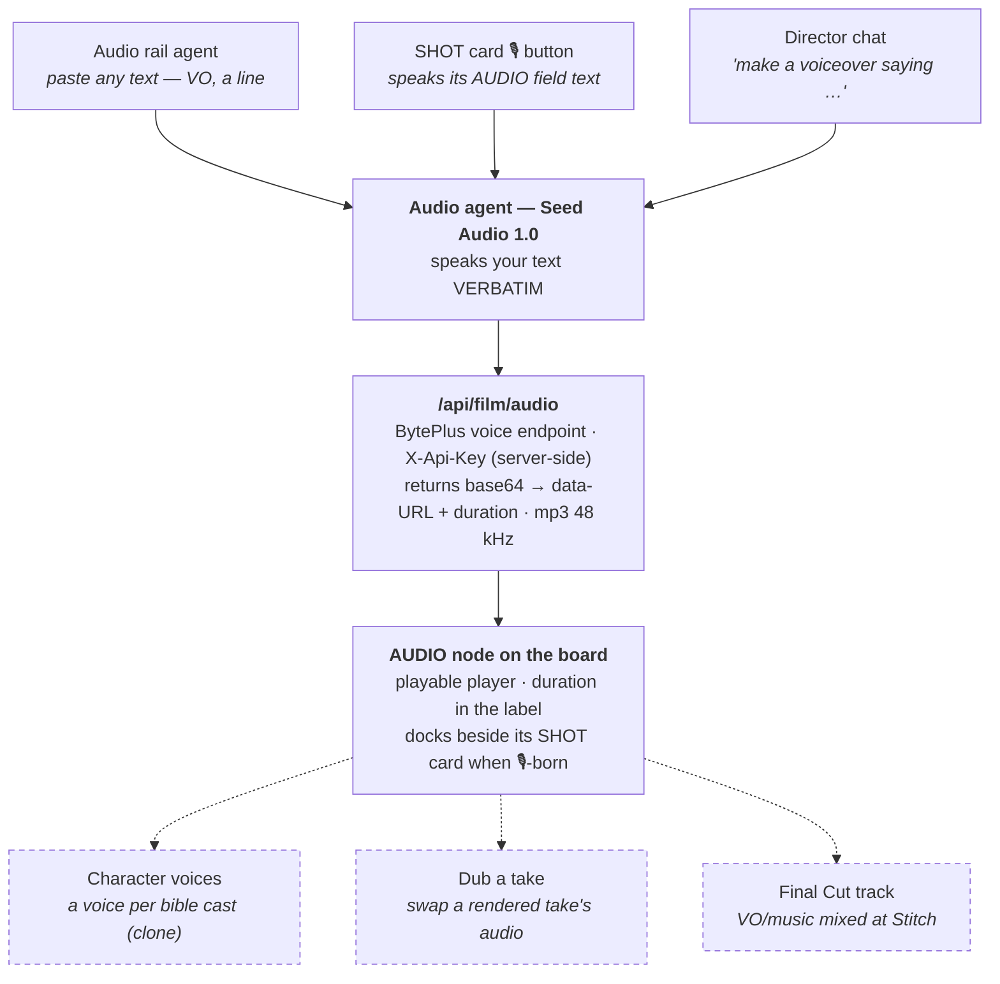

# Seed Audio 1.0 — Film Agent Integration Plan

> **Status:** M0 + M1 BUILT & LIVE-VERIFIED 2026-07-14 (standalone Audio agent only — the
> user explicitly deferred M2's card/chat hooks: "No integration with other agents yet").
> **Model reality check:** `seed-audio-1.0` returns **403 (code 45000030)** on this key's
> subscription — the shipped default is **`seed-tts-2.0`** (proven live); the route's
> `model` param flips to Seed Audio 1.0 with one string once the subscription has it.
> Delivery direction rides as `context_texts` (TTS 2.0's tone instruction).
> **One-line summary:** paste (or reuse) a line of text → one server-side TTS call → a
> **playable audio node on the film board**, verbatim, nothing hidden. Mixing into the film
> itself is explicitly Phase 2.
> **One-line summary:** paste (or reuse) a line of text → one server-side TTS call → a
> **playable audio node on the film board**, verbatim, nothing hidden. Mixing into the film
> itself is explicitly Phase 2.

## What already exists in the repo (verified 2026-07-14)

- **`pages/api/speech.js`** — a WORKING BytePlus voice route (resource `seed-tts-2.0`,
  `/api/v3/tts/unidirectional`, `X-Api-Key` + `X-Api-App-Key` headers, NDJSON stream →
  concatenated audio buffer). Used only by the generic playground page — the film suite
  never calls it. The film route reuses this proven streaming parse verbatim.
- **CutNode's AUDIO field** — SHOT cards already carry `data.audio` ("dialogue · ambient ·
  foley · score") and a `generateAudio` checkbox (Seedance on-take audio). The 🎙 button
  slots beside that existing field.
- **`AssetNode` `kind:'audio'`** — already renders a playable `<audio controls>` node.
- **Global media store** (`/api/film/media`, 2026-07-14) — mp3/wav types are already in
  its maps; the canvas check-in effect currently targets image/video only.

## Why

The film pipeline generates every visual artifact on the board (plates, keyframes, takes),
but **voice is missing as a first-class asset**: narration drafts, line reads, and VO
auditions currently happen outside the app. Seedance 2.0 does generate on-take audio
(including lip-synced dialogue from quoted lines in the prompt), so Phase 1 audio clips are
**standalone assets for auditioning and reference** — cheap to iterate before spending on
takes — not an automatic soundtrack.

## House rules (inherited from the board's design language)

- **Text is spoken VERBATIM** — the consistency rule applies to speech: Hindi dialogue
  stays Hindi, no rewriting, no translation.
- **No hidden generation** — every clip is one explicit tap; nothing runs under the hood.
- **No gates** — the agent works on an empty board.
- **Explicit inputs only** — the agent speaks what you typed (or what a SHOT card's AUDIO
  field already says); it never reads the selection or the bible silently.

## The flow

Dashed = **Phase 2** (not in scope now).

## API contract (Phase 1)

`pages/api/film/audio.js` — server-side only (the key never reaches the browser):

| Item | Value |
| --- | --- |
| Endpoint | BytePlus voice API, `POST …/api/v3/tts/create` (`ap-southeast-1`) |
| Auth header | `X-Api-Key: BYTEPLUSVOICE_API_KEY` (new `.env.local` entry) |
| Body | `{ model: 'seed-audio-1.0', text_prompt, audio_config, watermark: {} }` |
| Defaults | `mp3`, `48000` Hz |
| Response handling | base64 audio → `data:` URL + duration, returned to the client |
| Deferred | `references` (voice cloning) — Phase 2 |

> Exact field names, and any voice/emotion/delivery knobs the API exposes, get verified
> against the **BytePlus Seed Audio 1.0 HTTP API Integration Guide** at build time; if
> delivery instructions are supported they surface as an explicit panel field, never as a
> hidden prompt rewrite.

## Build plan (Phase 1)

- **M0 — server + core:** `/api/film/audio` route (streaming parse lifted from
  `pages/api/speech.js`, pointed at `seed-audio-1.0`); client `generateAudio`; core
  `generateFilmAudio({ text, config }, ctx)` in `utils/film/core` (pure, headless-safe).
- **M1 — rail Audio agent:** `audioAgent` in `utils/film/agents.js` (canvas-only `run()`
  guard, like Storyboard/Previz); LayerPanel branch = one textarea + format defaults;
  Run → an audio node laid on the board. **Zero new node type** — `AssetNode` already
  renders `kind: 'audio'` as a playable `<audio controls>` element; it just has no
  producer today. **Durability for free:** add `audio` to the media-store check-in
  effect's kinds (one condition) — the clip lands as a base64 `data:` url and is checked
  into `~/.modelark-starter-kit/media/<hash>.mp3` within seconds, with `data.url`
  replaced by the store url (no megabytes of base64 in project.json, survives reload).
- **M2 — in-context entry points:** the 🎙 button on the SHOT card's AUDIO section
  (speaks the existing `data.audio` field; clip docks beside the card, `sourceCutId`
  stamped — same pattern as previz-from-card) and the `audio` action in the Director
  chat (`FILM_ACTIONS` + `ACTION_DESCRIBE` + dispatch case, one-tap confirm).

## Board entities & UX elements that can use the agent

| Entity / element | How it uses Audio | Phase |
| --- | --- | --- |
| **Left rail — Audio agent** | Paste any text → clip node. Works with nothing selected. | 1 |
| **SHOT card (CutNode)** | 🎙 on the AUDIO section speaks that field's text; clip docks beside the card. | 1 |
| **Director chat (FilmDock)** | "make a voiceover saying…" routes to the `audio` action. | 1 |
| **Audio nodes (AssetNode `kind:'audio'`)** | Playable in place, renameable, deletable, persist with the board. | 1 |
| **Bible cast cards** | Assign a cloned **voice per character**; dialogue TTS in that voice. | 2 |
| **Take nodes** | **Dub** — replace a rendered take's audio (server ffmpeg remux). | 2 |
| **Final Cut timeline / Stitch** | VO/music **track** mixed into the stitched film (ffmpeg audio mix). | 2 |

## Honest limits (Phase 1)

- A generated clip does **not** automatically end up inside the film — there is no audio
  mixing in Stitch yet. Phase 1's value is auditioning narration and line reads cheaply,
  in the right direction, before spending on takes.
- Seedance's own on-take audio (dialogue lip-sync from quoted prompt lines) remains the
  way spoken lines get **into** a take; the Audio agent complements it, it does not
  replace it.
- Voice cloning (`references`) is deferred until a voice-sample capture/upload flow exists.
